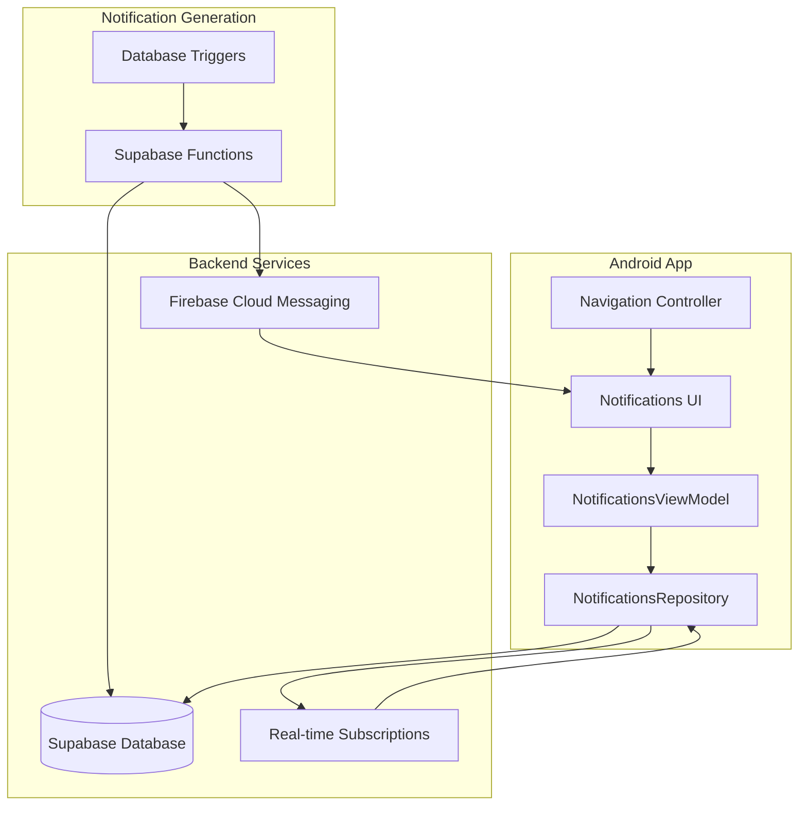

# Technical Design Document: Notifications System

## Overview

The notifications system is a comprehensive real-time notification management solution that replaces the existing "Bid" navigation tab in the MineTeh Android app. The system provides users with immediate updates about marketplace activities including bid updates, auction endings, item sales, messages, and other relevant events.

The design follows the existing MVVM architecture pattern used throughout the app, integrating seamlessly with the current Supabase backend infrastructure. The system consists of four main components: database schema, Android application layer, real-time synchronization, and push notification delivery.

Key features include:
- Real-time notification generation and delivery
- In-app notification management with read/unread states
- Push notification integration via Firebase Cloud Messaging
- User-configurable notification preferences
- Automatic cleanup and performance optimization
- Deep linking to relevant app screens

## Architecture

### System Architecture Overview



### Component Architecture

The notifications system follows the established repository pattern used in the existing codebase:

1. **Data Layer**: NotificationsRepository handles all data operations with Supabase
2. **Domain Layer**: Notification models and business logic
3. **Presentation Layer**: NotificationsViewModel manages UI state and user interactions
4. **UI Layer**: NotificationsActivity and adapter handle user interface

### Integration Points

- **Navigation**: Replaces BidActivity in bottom navigation
- **Authentication**: Integrates with existing TokenManager for user context
- **Database**: Extends existing Supabase schema with notifications table
- **Real-time**: Uses Supabase real-time subscriptions like existing features
- **Push Notifications**: New FCM integration following Android best practices

## Components and Interfaces

### Database Schema

#### Notifications Table

```sql
CREATE TABLE notifications (
    id BIGSERIAL PRIMARY KEY,
    user_id BIGINT REFERENCES accounts(account_id) ON DELETE CASCADE,
    type VARCHAR(50) NOT NULL,
    title VARCHAR(255) NOT NULL,
    message TEXT NOT NULL,
    data JSONB,
    is_read BOOLEAN DEFAULT FALSE,
    created_at TIMESTAMP DEFAULT NOW(),
    updated_at TIMESTAMP DEFAULT NOW()
);

-- Indexes for performance
CREATE INDEX idx_notifications_user_id ON notifications(user_id);
CREATE INDEX idx_notifications_type ON notifications(type);
CREATE INDEX idx_notifications_is_read ON notifications(is_read);
CREATE INDEX idx_notifications_created_at ON notifications(created_at);
CREATE INDEX idx_notifications_user_unread ON notifications(user_id, is_read) WHERE is_read = false;
```

#### Notification Preferences Table

```sql
CREATE TABLE notification_preferences (
    id BIGSERIAL PRIMARY KEY,
    user_id BIGINT REFERENCES accounts(account_id) ON DELETE CASCADE UNIQUE,
    bid_placed_enabled BOOLEAN DEFAULT TRUE,
    bid_outbid_enabled BOOLEAN DEFAULT TRUE,
    auction_ending_enabled BOOLEAN DEFAULT TRUE,
    auction_won_enabled BOOLEAN DEFAULT TRUE,
    auction_lost_enabled BOOLEAN DEFAULT TRUE,
    item_sold_enabled BOOLEAN DEFAULT TRUE,
    new_message_enabled BOOLEAN DEFAULT TRUE,
    listing_approved_enabled BOOLEAN DEFAULT TRUE,
    payment_received_enabled BOOLEAN DEFAULT TRUE,
    push_notifications_enabled BOOLEAN DEFAULT TRUE,
    quiet_hours_start TIME,
    quiet_hours_end TIME,
    created_at TIMESTAMP DEFAULT NOW(),
    updated_at TIMESTAMP DEFAULT NOW()
);
```

### Android Components

#### NotificationsRepository

```kotlin
class NotificationsRepository(private val context: Context) {
    private val supabase = SupabaseClient.client
    private val tokenManager = TokenManager(context)
    
    // Core CRUD operations
    suspend fun getNotifications(userId: Int, limit: Int = 50, offset: Int = 0): Resource<List<Notification>>
    suspend fun markAsRead(notificationId: Int): Resource<Boolean>
    suspend fun markAllAsRead(userId: Int): Resource<Boolean>
    suspend fun getUnreadCount(userId: Int): Resource<Int>
    
    // Real-time subscriptions
    fun subscribeToNotifications(userId: Int): Flow<List<Notification>>
    
    // Preferences management
    suspend fun getPreferences(userId: Int): Resource<NotificationPreferences>
    suspend fun updatePreferences(userId: Int, preferences: NotificationPreferences): Resource<Boolean>
}
```

#### NotificationsViewModel

```kotlin
class NotificationsViewModel(application: Application) : AndroidViewModel(application) {
    private val repository = NotificationsRepository(application)
    private val tokenManager = TokenManager(application)
    
    private val _notifications = MutableLiveData<Resource<List<Notification>>>()
    val notifications: LiveData<Resource<List<Notification>>> = _notifications
    
    private val _unreadCount = MutableLiveData<Int>()
    val unreadCount: LiveData<Int> = _unreadCount
    
    fun loadNotifications()
    fun markAsRead(notificationId: Int)
    fun markAllAsRead()
    fun refreshNotifications()
}
```

#### Notification Models

```kotlin
@Serializable
data class Notification(
    val id: Int,
    val userId: Int,
    val type: NotificationType,
    val title: String,
    val message: String,
    val data: Map<String, String>? = null,
    val isRead: Boolean = false,
    val createdAt: String,
    val updatedAt: String
)

enum class NotificationType {
    BID_PLACED,
    BID_OUTBID,
    AUCTION_ENDING,
    AUCTION_WON,
    AUCTION_LOST,
    ITEM_SOLD,
    NEW_MESSAGE,
    LISTING_APPROVED,
    PAYMENT_RECEIVED
}

@Serializable
data class NotificationPreferences(
    val userId: Int,
    val bidPlacedEnabled: Boolean = true,
    val bidOutbidEnabled: Boolean = true,
    val auctionEndingEnabled: Boolean = true,
    val auctionWonEnabled: Boolean = true,
    val auctionLostEnabled: Boolean = true,
    val itemSoldEnabled: Boolean = true,
    val newMessageEnabled: Boolean = true,
    val listingApprovedEnabled: Boolean = true,
    val paymentReceivedEnabled: Boolean = true,
    val pushNotificationsEnabled: Boolean = true,
    val quietHoursStart: String? = null,
    val quietHoursEnd: String? = null
)
```

### Navigation Integration

#### Bottom Navigation Update

The existing bottom navigation in `homepage.xml` and `bid.xml` will be updated:

```xml
<!-- Replace nav_bid with nav_notifications -->
<LinearLayout
    android:id="@+id/nav_notifications"
    android:layout_width="0dp"
    android:layout_height="wrap_content"
    android:layout_weight="1"
    android:gravity="center"
    android:orientation="vertical"
    android:paddingVertical="8dp">

    <FrameLayout
        android:layout_width="wrap_content"
        android:layout_height="wrap_content">
        
        <ImageView
            android:layout_width="24dp"
            android:layout_height="24dp"
            android:src="@drawable/ic_notifications"
            android:layout_marginBottom="4dp"/>
            
        <!-- Notification badge -->
        <TextView
            android:id="@+id/notificationBadge"
            android:layout_width="16dp"
            android:layout_height="16dp"
            android:layout_gravity="top|end"
            android:background="@drawable/notification_badge_bg"
            android:gravity="center"
            android:textColor="@color/white"
            android:textSize="10sp"
            android:visibility="gone"/>
    </FrameLayout>
    
    <TextView
        android:text="Notifications"
        android:layout_width="wrap_content"
        android:layout_height="wrap_content"
        android:textStyle="bold"
        android:textColor="@color/black"
        android:textSize="12sp"/>
</LinearLayout>
```

### Real-time Updates

#### Supabase Real-time Integration

```kotlin
class NotificationRealtimeManager(private val repository: NotificationsRepository) {
    private var subscription: RealtimeChannel? = null
    
    fun startListening(userId: Int) {
        subscription = SupabaseClient.client.realtime.createChannel("notifications") {
            postgresChanges {
                event = PostgresAction.INSERT
                schema = "public"
                table = "notifications"
                filter = "user_id=eq.$userId"
            }
        }
        
        subscription?.subscribe { status ->
            when (status) {
                is RealtimeChannel.Status.SUBSCRIBED -> {
                    // Handle new notifications
                }
                is RealtimeChannel.Status.CHANNEL_ERROR -> {
                    // Handle errors
                }
            }
        }
    }
    
    fun stopListening() {
        subscription?.unsubscribe()
        subscription = null
    }
}
```

### Push Notification Integration

#### Firebase Cloud Messaging Setup

```kotlin
class NotificationService : FirebaseMessagingService() {
    
    override fun onMessageReceived(remoteMessage: RemoteMessage) {
        super.onMessageReceived(remoteMessage)
        
        val notificationData = remoteMessage.data
        val title = notificationData["title"] ?: "MineTeh"
        val message = notificationData["message"] ?: ""
        val type = notificationData["type"] ?: ""
        val deepLink = notificationData["deep_link"]
        
        showNotification(title, message, deepLink)
    }
    
    override fun onNewToken(token: String) {
        super.onNewToken(token)
        // Send token to server
        sendTokenToServer(token)
    }
    
    private fun showNotification(title: String, message: String, deepLink: String?) {
        val intent = createDeepLinkIntent(deepLink)
        val pendingIntent = PendingIntent.getActivity(this, 0, intent, PendingIntent.FLAG_IMMUTABLE)
        
        val notification = NotificationCompat.Builder(this, CHANNEL_ID)
            .setContentTitle(title)
            .setContentText(message)
            .setSmallIcon(R.drawable.ic_notifications)
            .setContentIntent(pendingIntent)
            .setAutoCancel(true)
            .build()
            
        NotificationManagerCompat.from(this).notify(System.currentTimeMillis().toInt(), notification)
    }
}
```

## Data Models

### Core Data Models

#### Notification Entity

```kotlin
@Serializable
data class SupabaseNotificationResponse(
    val id: Int,
    val user_id: Int,
    val type: String,
    val title: String,
    val message: String,
    val data: Map<String, String>? = null,
    val is_read: Boolean = false,
    val created_at: String,
    val updated_at: String
) {
    fun toNotification(): Notification {
        return Notification(
            id = id,
            userId = user_id,
            type = NotificationType.valueOf(type),
            title = title,
            message = message,
            data = data,
            isRead = is_read,
            createdAt = created_at,
            updatedAt = updated_at
        )
    }
}
```

#### Notification Generation Data

```kotlin
data class NotificationContext(
    val userId: Int,
    val type: NotificationType,
    val listingId: Int? = null,
    val bidId: Int? = null,
    val messageId: Int? = null,
    val amount: Double? = null,
    val additionalData: Map<String, String> = emptyMap()
)

data class NotificationTemplate(
    val type: NotificationType,
    val titleTemplate: String,
    val messageTemplate: String
) {
    fun generateNotification(context: NotificationContext, templateData: Map<String, String>): Notification {
        val title = titleTemplate.replace(templateData)
        val message = messageTemplate.replace(templateData)
        
        return Notification(
            id = 0, // Will be set by database
            userId = context.userId,
            type = type,
            title = title,
            message = message,
            data = context.additionalData,
            isRead = false,
            createdAt = "", // Will be set by database
            updatedAt = ""
        )
    }
}
```

### Database Trigger Functions

#### Notification Generation Triggers

```sql
-- Function to create bid notifications
CREATE OR REPLACE FUNCTION create_bid_notification()
RETURNS TRIGGER AS $$
BEGIN
    -- Notify seller of new bid
    INSERT INTO notifications (user_id, type, title, message, data)
    SELECT 
        l.seller_id,
        'BID_PLACED',
        'New bid on your item',
        'Someone placed a bid of ₱' || NEW.bid_amount || ' on your ' || l.title,
        json_build_object(
            'listing_id', NEW.listing_id,
            'bid_id', NEW.bid_id,
            'bid_amount', NEW.bid_amount
        )::jsonb
    FROM listings l
    WHERE l.id = NEW.listing_id;
    
    -- Notify previous highest bidder if outbid
    INSERT INTO notifications (user_id, type, title, message, data)
    SELECT DISTINCT
        b.user_id,
        'BID_OUTBID',
        'You have been outbid',
        'Someone placed a higher bid on ' || l.title,
        json_build_object(
            'listing_id', NEW.listing_id,
            'new_bid_amount', NEW.bid_amount
        )::jsonb
    FROM bids b
    JOIN listings l ON l.id = b.listing_id
    WHERE b.listing_id = NEW.listing_id 
    AND b.user_id != NEW.user_id
    AND b.bid_amount < NEW.bid_amount;
    
    RETURN NEW;
END;
$$ LANGUAGE plpgsql;

-- Create trigger
CREATE TRIGGER bid_notification_trigger
    AFTER INSERT ON bids
    FOR EACH ROW
    EXECUTE FUNCTION create_bid_notification();
```

## Correctness Properties

*A property is a characteristic or behavior that should hold true across all valid executions of a system-essentially, a formal statement about what the system should do. Properties serve as the bridge between human-readable specifications and machine-verifiable correctness guarantees.*

### Property 1: Navigation Tab Replacement

*For any* user interaction with the bottom navigation, the notifications tab should be present instead of the bid tab and should navigate to the notifications screen when selected.

**Validates: Requirements 1.2, 1.5**

### Property 2: Notification Type Support

*For any* supported notification type (BID_PLACED, BID_OUTBID, AUCTION_ENDING, AUCTION_WON, AUCTION_LOST, ITEM_SOLD, NEW_MESSAGE, LISTING_APPROVED, PAYMENT_RECEIVED), the system should be able to create, store, and retrieve notifications of that type.

**Validates: Requirements 2.4**

### Property 3: JSON Data Storage

*For any* notification with additional context data, the system should store and retrieve the data in JSON format without data loss.

**Validates: Requirements 2.5**

### Property 4: Bid Notification Generation

*For any* bid placed on a user's listing, the system should create a BID_PLACED notification for the seller with correct listing and bid information.

**Validates: Requirements 3.1**

### Property 5: Outbid Notification Generation

*For any* bid that outbids a previous bidder, the system should create a BID_OUTBID notification for the previous highest bidder.

**Validates: Requirements 3.2**

### Property 6: Auction Ending Notification Generation

*For any* auction ending in 1 hour, the system should create AUCTION_ENDING notifications for all bidders on that auction.

**Validates: Requirements 3.3**

### Property 7: Auction Completion Notification Generation

*For any* completed auction, the system should create an AUCTION_WON notification for the winner and AUCTION_LOST notifications for all other bidders.

**Validates: Requirements 3.4**

### Property 8: Item Sale Notification Generation

*For any* fixed-price item that is sold, the system should create an ITEM_SOLD notification for the seller.

**Validates: Requirements 3.5**

### Property 9: Message Notification Generation

*For any* new message received, the system should create a NEW_MESSAGE notification for the recipient.

**Validates: Requirements 3.6**

### Property 10: Notification Context Data

*For any* notification created, the system should include relevant listing and user data in the notification's data field.

**Validates: Requirements 3.7**

### Property 11: Chronological Ordering

*For any* list of notifications displayed, they should be ordered in reverse chronological order (newest first).

**Validates: Requirements 4.1**

### Property 12: Notification Display Information

*For any* notification displayed, it should show the notification icon, title, message, and timestamp.

**Validates: Requirements 4.2**

### Property 13: Read/Unread Visual Distinction

*For any* notification displayed, the UI should visually distinguish between read and unread states.

**Validates: Requirements 4.3**

### Property 14: Type-Based Icons

*For any* notification type, the system should display the appropriate icon based on the notification type.

**Validates: Requirements 4.4**

### Property 15: Notification Tap Actions

*For any* notification tapped by the user, the system should mark it as read and navigate to the relevant screen.

**Validates: Requirements 4.5**

### Property 16: Pull-to-Refresh Functionality

*For any* pull-to-refresh gesture on the notifications screen, the system should reload and display updated notifications.

**Validates: Requirements 4.7**

### Property 17: Push Notification Delivery

*For any* notification created, the system should send a corresponding push notification to the user's device.

**Validates: Requirements 5.2**

### Property 18: Push Notification Content

*For any* push notification sent, it should include the notification title, message, and deep link data.

**Validates: Requirements 5.3**

### Property 19: Push Notification Navigation

*For any* push notification tapped, the system should open the app and navigate to the relevant screen.

**Validates: Requirements 5.4**

### Property 20: Multi-State Push Delivery

*For any* app state (foreground, background, or closed), the system should handle push notification delivery appropriately.

**Validates: Requirements 5.5**

### Property 21: Preference-Based Push Delivery

*For any* notification type, push notifications should only be delivered if the user's preferences allow it.

**Validates: Requirements 5.6**

### Property 22: Notification Type Preferences

*For any* notification type, users should be able to enable or disable notifications for that specific type.

**Validates: Requirements 6.1**

### Property 23: Global Push Preference

*For any* user, they should be able to enable or disable push notifications globally.

**Validates: Requirements 6.2**

### Property 24: Quiet Hours Functionality

*For any* time range set as quiet hours, push notifications should not be delivered during those hours.

**Validates: Requirements 6.3**

### Property 25: Preference Persistence

*For any* user's notification preferences, they should be stored and persist across app sessions.

**Validates: Requirements 6.4**

### Property 26: Preference Enforcement

*For any* preference update, the system should respect the new settings for all future notifications.

**Validates: Requirements 6.5**

### Property 27: Repository CRUD Operations

*For any* notification, the repository should support creating, reading, updating, and deleting operations.

**Validates: Requirements 7.1**

### Property 28: Paginated Notification Fetching

*For any* user's notifications, the repository should support fetching them with pagination parameters.

**Validates: Requirements 7.2**

### Property 29: Single Notification Read Marking

*For any* notification, the repository should support marking it as read.

**Validates: Requirements 7.3**

### Property 30: Bulk Read Marking

*For any* user, the repository should support marking all their notifications as read.

**Validates: Requirements 7.4**

### Property 31: Notification Filtering

*For any* combination of notification type and read status filters, the repository should return appropriately filtered results.

**Validates: Requirements 7.5**

### Property 32: Database Error Handling

*For any* database operation failure, the repository should handle the error gracefully and return appropriate error states.

**Validates: Requirements 7.6**

### Property 33: Real-time Notification Updates

*For any* new notification inserted for the current user, the real-time listener should update the notifications list immediately.

**Validates: Requirements 8.2**

### Property 34: Real-time Read State Updates

*For any* notification marked as read, the real-time listener should update the UI immediately.

**Validates: Requirements 8.3**

### Property 35: Subscription Persistence

*For any* time the notifications screen is active, the real-time listener should maintain the subscription.

**Validates: Requirements 8.4**

### Property 36: Connection Error Recovery

*For any* connection error or interruption, the real-time listener should handle it gracefully and attempt reconnection.

**Validates: Requirements 8.5**

### Property 37: Notification Badge Display

*For any* unread notifications, the navigation controller should display a badge on the notifications tab.

**Validates: Requirements 9.1**

### Property 38: Badge Count Accuracy

*For any* number of unread notifications, the badge should show the correct count.

**Validates: Requirements 9.2**

### Property 39: Real-time Badge Updates

*For any* change in notification read state, the badge count should update in real-time.

**Validates: Requirements 9.3**

### Property 40: Unread Count Accuracy

*For any* app state, the system should maintain an accurate count of unread notifications.

**Validates: Requirements 9.5**

### Property 41: Navigation Context Data

*For any* notification navigation, the system should pass relevant IDs and context data to the destination screen.

**Validates: Requirements 10.6**

### Property 42: Invalid Navigation Handling

*For any* notification with invalid or non-existent target data, the system should show an appropriate error message.

**Validates: Requirements 10.7**

### Property 43: Automatic Cleanup

*For any* notifications older than 90 days, the system should automatically delete them during cleanup operations.

**Validates: Requirements 11.1**

### Property 44: Cleanup Scheduling

*For any* cleanup operation, it should run during low-usage periods to minimize performance impact.

**Validates: Requirements 11.2**

### Property 45: Recent Notification Preservation

*For any* user, the system should maintain at least their 50 most recent notifications regardless of age.

**Validates: Requirements 11.3**

### Property 46: Cleanup Logging

*For any* cleanup operation performed, the system should log the operation for monitoring purposes.

**Validates: Requirements 11.4**

### Property 47: Storage Priority

*For any* storage constraint scenario, the system should prioritize keeping unread notifications over read ones.

**Validates: Requirements 11.5**

### Property 48: Offline Notification Queuing

*For any* network connectivity loss, the system should queue notifications for delivery when connection is restored.

**Validates: Requirements 12.1**

### Property 49: Push Delivery Retry

*For any* push notification delivery failure, the system should retry delivery with exponential backoff.

**Validates: Requirements 12.2**

### Property 50: Database Failure Resilience

*For any* database operation failure, the system should return appropriate error states without crashing.

**Validates: Requirements 12.3**

### Property 51: Malformed Data Handling

*For any* malformed notification data encountered, the system should handle it gracefully without breaking functionality.

**Validates: Requirements 12.4**

### Property 52: Critical Notification Fallbacks

*For any* critical notification (like auction endings), the system should provide fallback delivery mechanisms in case of failures.

**Validates: Requirements 12.5**

### Property 53: Error Logging

*For any* error encountered, the system should log it for debugging while maintaining user experience.

**Validates: Requirements 12.6**

## Error Handling

### Database Error Handling

The notifications system implements comprehensive error handling for database operations:

1. **Connection Failures**: Graceful degradation with offline queuing
2. **Query Timeouts**: Retry mechanisms with exponential backoff
3. **Constraint Violations**: Proper error messages and recovery
4. **Data Corruption**: Validation and sanitization of all inputs

### Network Error Handling

Network-related errors are handled through multiple strategies:

1. **Offline Mode**: Queue notifications for later delivery
2. **Retry Logic**: Exponential backoff for failed operations
3. **Fallback Mechanisms**: Alternative delivery paths for critical notifications
4. **User Feedback**: Clear error messages and recovery suggestions

### Real-time Subscription Errors

Real-time connection issues are managed through:

1. **Automatic Reconnection**: Seamless reconnection on connection loss
2. **State Synchronization**: Ensure UI state matches server state after reconnection
3. **Error Boundaries**: Prevent real-time errors from crashing the app
4. **Graceful Degradation**: Fall back to polling if real-time fails

### Push Notification Errors

Push notification failures are handled via:

1. **Token Management**: Automatic token refresh and validation
2. **Delivery Confirmation**: Track and retry failed deliveries
3. **Platform Differences**: Handle iOS/Android specific requirements
4. **User Permissions**: Graceful handling of denied permissions

## Testing Strategy

### Dual Testing Approach

The notifications system will be tested using both unit tests and property-based tests to ensure comprehensive coverage:

**Unit Tests** focus on:
- Specific notification type examples (BID_PLACED, AUCTION_WON, etc.)
- Edge cases like empty notification lists and malformed data
- Integration points between components
- Error conditions and recovery scenarios
- UI component behavior and navigation

**Property-Based Tests** focus on:
- Universal properties that hold for all notifications
- Comprehensive input coverage through randomization
- Data integrity across all operations
- Performance characteristics under various loads
- Correctness properties defined in this document

### Property-Based Testing Configuration

The system will use **Kotest Property Testing** for Android Kotlin development:

- **Minimum 100 iterations** per property test to ensure statistical confidence
- Each property test references its corresponding design document property
- **Tag format**: `Feature: notifications-system, Property {number}: {property_text}`
- Tests will generate random notification data, user IDs, and system states
- Comprehensive coverage of all notification types and user scenarios

### Unit Testing Balance

Unit tests complement property tests by providing:
- **Concrete Examples**: Specific scenarios that demonstrate correct behavior
- **Integration Testing**: Verify component interactions work correctly
- **Edge Case Coverage**: Test boundary conditions and error states
- **UI Testing**: Verify user interface components render and behave correctly

Property tests handle the heavy lifting of testing universal correctness properties across all possible inputs, while unit tests ensure specific critical paths work as expected.

### Test Categories

1. **Database Tests**: Schema validation, CRUD operations, constraint enforcement
2. **Repository Tests**: Data access layer functionality and error handling
3. **ViewModel Tests**: Business logic and state management
4. **UI Tests**: User interface components and navigation
5. **Integration Tests**: End-to-end notification flow
6. **Performance Tests**: Load testing and resource usage
7. **Real-time Tests**: Subscription management and live updates
8. **Push Notification Tests**: FCM integration and delivery

Each category includes both unit and property-based tests where appropriate, ensuring the notifications system is thoroughly validated before deployment.