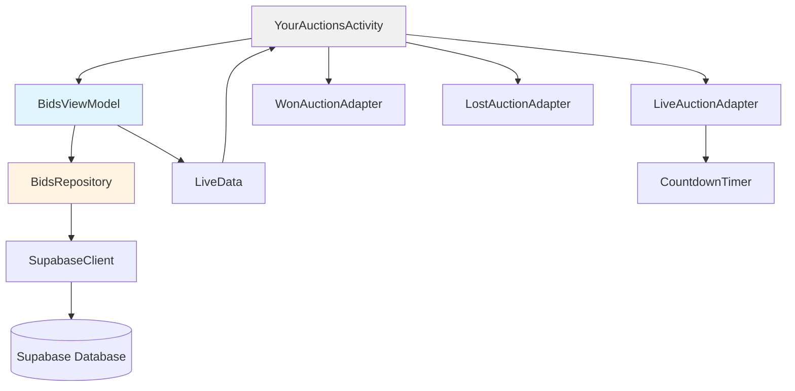

# Design Document: User Bids Tracking

## Overview

The user-bids-tracking feature enables users to view and manage all their auction bids organized by status (Live, Won, Lost). The feature integrates with the existing YourAuctionsActivity UI and replaces dummy adapters with real data from Supabase.

The implementation follows the existing MVVM architecture pattern used throughout the app, with a BidsRepository for data access, a BidsViewModel for business logic, and updated UI components in YourAuctionsActivity. The feature queries the Supabase bids table with joins to the listings table to retrieve complete auction information, categorizes bids based on auction status and timing, and provides real-time updates for live auctions.

Key technical considerations:
- Supabase Postgrest 2.0.0 has limited query capabilities, requiring client-side filtering and joins
- Countdown timers need efficient updates without excessive recomposition
- Auto-refresh mechanism must be lifecycle-aware to conserve resources
- The app already uses similar patterns in ListingsRepository and HomeViewModel

## Architecture

### Component Overview



### Data Flow

1. **Initialization**: YourAuctionsActivity creates BidsViewModel, which triggers initial data fetch
2. **Data Fetching**: BidsRepository queries Supabase bids table, then fetches related listings and accounts
3. **Categorization**: BidsViewModel receives raw data and categorizes into Live/Won/Lost based on end_time and bid_amount
4. **UI Update**: LiveData emits BidsUiState to YourAuctionsActivity, which updates the appropriate RecyclerView adapters
5. **Auto-Refresh**: For live auctions, a coroutine-based timer triggers refresh every 30 seconds while the activity is active
6. **User Interaction**: Tapping a bid item launches ItemDetailActivity with the listing_id

### Lifecycle Management

The feature implements lifecycle-aware components:
- Auto-refresh coroutine is launched in `onResume()` and cancelled in `onPause()`
- Countdown timers are managed per ViewHolder and cancelled when views are recycled
- ViewModel survives configuration changes, preventing unnecessary data refetches

## Components and Interfaces

### 1. BidsRepository

**Responsibility**: Data layer component that queries Supabase for user bid data

**Key Methods**:

```kotlin
class BidsRepository(private val context: Context) {
    private val tokenManager = TokenManager(context)
    
    /**
     * Fetches all bids for the authenticated user with complete listing information
     * @return Resource<List<UserBidWithListing>> containing bid and listing data
     */
    suspend fun getUserBids(): Resource<List<UserBidWithListing>>
    
    /**
     * Parses bids JSON response from Supabase
     */
    private fun parseBidsResponse(jsonData: String): List<UserBidData>
    
    /**
     * Fetches listings for the given listing IDs
     */
    private suspend fun fetchListingsForBids(listingIds: List<Int>): Map<Int, Listing>
    
    /**
     * Fetches highest bid for each listing
     */
    private suspend fun fetchHighestBids(listingIds: List<Int>): Map<Int, Double>
}
```

**Query Strategy**:

Since Supabase Postgrest 2.0.0 has limited join capabilities, the repository uses a multi-step approach:

1. Query `bids` table filtered by `user_id` (from TokenManager)
2. Extract unique `listing_id` values from bid results
3. Query `listings` table for those IDs (reusing ListingsRepository parsing logic)
4. Query `bids` table again to get highest bid for each listing (MAX aggregation done client-side)
5. Combine all data into `UserBidWithListing` objects

### 2. Data Models

**UserBidData**: Represents a single bid record from the database

```kotlin
data class UserBidData(
    val bidId: Int,
    val userId: Int,
    val listingId: Int,
    val bidAmount: Double,
    val bidTime: String
)
```

**UserBidWithListing**: Combines bid data with complete listing information

```kotlin
data class UserBidWithListing(
    val bid: UserBidData,
    val listing: Listing,
    val highestBid: Double
)
```

**BidsUiState**: Represents the UI state for the bids screen

```kotlin
sealed class BidsUiState {
    object Loading : BidsUiState()
    data class Success(
        val liveBids: List<UserBidWithListing>,
        val wonBids: List<UserBidWithListing>,
        val lostBids: List<UserBidWithListing>
    ) : BidsUiState()
    data class Error(val message: String) : BidsUiState()
}
```

### 3. BidsViewModel

**Responsibility**: Presentation layer component that manages bid state and categorization logic

**Key Properties**:

```kotlin
class BidsViewModel(application: Application) : AndroidViewModel(application) {
    private val repository = BidsRepository(application)
    
    private val _bidsState = MutableLiveData<BidsUiState>()
    val bidsState: LiveData<BidsUiState> = _bidsState
    
    private var autoRefreshJob: Job? = null
}
```

**Key Methods**:

```kotlin
/**
 * Fetches and categorizes user bids
 */
fun fetchBids()

/**
 * Categorizes bids into Live/Won/Lost based on auction status
 */
private fun categorizeBids(bids: List<UserBidWithListing>): Triple<List, List, List>

/**
 * Starts auto-refresh for live auctions (every 30 seconds)
 */
fun startAutoRefresh()

/**
 * Stops auto-refresh when activity is paused
 */
fun stopAutoRefresh()

/**
 * Determines if an auction is still live
 */
private fun isAuctionLive(endTime: String): Boolean

/**
 * Determines if user won the auction
 */
private fun didUserWin(userBid: Double, highestBid: Double): Boolean
```

**Categorization Logic**:

```kotlin
private fun categorizeBids(bids: List<UserBidWithListing>): Triple<...> {
    val now = System.currentTimeMillis()
    val liveBids = mutableListOf<UserBidWithListing>()
    val wonBids = mutableListOf<UserBidWithListing>()
    val lostBids = mutableListOf<UserBidWithListing>()
    
    for (bid in bids) {
        val endTime = parseEndTime(bid.listing.endTime)
        val isLive = endTime > now && bid.listing.status == "active"
        
        if (isLive) {
            liveBids.add(bid)
        } else {
            // Auction ended
            if (bid.bid.bidAmount >= bid.highestBid && bid.listing.status == "sold") {
                wonBids.add(bid)
            } else {
                lostBids.add(bid)
            }
        }
    }
    
    return Triple(liveBids, wonBids, lostBids)
}
```

### 4. YourAuctionsActivity Updates

**Current State**: Uses dummy adapters with hardcoded item counts

**Required Changes**:

1. Add BidsViewModel initialization
2. Observe `bidsState` LiveData
3. Replace dummy adapters with real adapters that accept data
4. Add loading/error state UI
5. Implement auto-refresh lifecycle management

**Updated Structure**:

```kotlin
class YourAuctionsActivity : AppCompatActivity() {
    private lateinit var binding: YourAuctionsBinding
    private lateinit var viewModel: BidsViewModel
    
    private lateinit var liveAdapter: LiveAuctionAdapter
    private lateinit var wonAdapter: WonAuctionAdapter
    private lateinit var lostAdapter: LostAuctionAdapter
    
    override fun onCreate(savedInstanceState: Bundle?) {
        // ... existing setup
        viewModel = ViewModelProvider(this)[BidsViewModel::class.java]
        setupObservers()
        viewModel.fetchBids()
    }
    
    override fun onResume() {
        super.onResume()
        viewModel.startAutoRefresh()
    }
    
    override fun onPause() {
        super.onPause()
        viewModel.stopAutoRefresh()
    }
    
    private fun setupObservers() {
        viewModel.bidsState.observe(this) { state ->
            when (state) {
                is BidsUiState.Loading -> showLoading()
                is BidsUiState.Success -> showBids(state)
                is BidsUiState.Error -> showError(state.message)
            }
        }
    }
}
```

### 5. RecyclerView Adapters

**LiveAuctionAdapter**: Displays active auction bids with countdown timers

```kotlin
class LiveAuctionAdapter(
    private val onItemClick: (UserBidWithListing) -> Unit
) : RecyclerView.Adapter<LiveAuctionAdapter.ViewHolder>() {
    
    private var bids = listOf<UserBidWithListing>()
    
    fun submitList(newBids: List<UserBidWithListing>) {
        bids = newBids
        notifyDataSetChanged()
    }
    
    inner class ViewHolder(private val binding: ItemAuctionLiveBinding) : 
        RecyclerView.ViewHolder(binding.root) {
        
        private var countdownJob: Job? = null
        
        fun bind(bidWithListing: UserBidWithListing) {
            // Bind listing data
            binding.tvTitle.text = bidWithListing.listing.title
            binding.tvYourBid.text = formatCurrency(bidWithListing.bid.bidAmount)
            binding.tvHighestBid.text = formatCurrency(bidWithListing.highestBid)
            
            // Show winning/outbid indicator
            val isWinning = bidWithListing.bid.bidAmount >= bidWithListing.highestBid
            binding.tvStatus.text = if (isWinning) "Winning" else "Outbid"
            binding.tvStatus.setTextColor(if (isWinning) Color.GREEN else Color.RED)
            
            // Start countdown timer
            startCountdown(bidWithListing.listing.endTime)
            
            // Click listener
            binding.root.setOnClickListener { onItemClick(bidWithListing) }
        }
        
        private fun startCountdown(endTime: String) {
            countdownJob?.cancel()
            countdownJob = CoroutineScope(Dispatchers.Main).launch {
                while (isActive) {
                    val remaining = calculateTimeRemaining(endTime)
                    binding.tvCountdown.text = formatCountdown(remaining)
                    delay(1000)
                }
            }
        }
        
        fun cancelCountdown() {
            countdownJob?.cancel()
        }
    }
    
    override fun onViewRecycled(holder: ViewHolder) {
        super.onViewRecycled(holder)
        holder.cancelCountdown()
    }
}
```

**WonAuctionAdapter**: Displays won auctions

```kotlin
class WonAuctionAdapter(
    private val onItemClick: (UserBidWithListing) -> Unit
) : RecyclerView.Adapter<WonAuctionAdapter.ViewHolder>() {
    
    private var bids = listOf<UserBidWithListing>()
    
    fun submitList(newBids: List<UserBidWithListing>) {
        bids = newBids
        notifyDataSetChanged()
    }
    
    inner class ViewHolder(private val binding: ItemAuctionWonBinding) : 
        RecyclerView.ViewHolder(binding.root) {
        
        fun bind(bidWithListing: UserBidWithListing) {
            binding.tvTitle.text = bidWithListing.listing.title
            binding.tvWinningBid.text = formatCurrency(bidWithListing.bid.bidAmount)
            binding.tvEndTime.text = formatEndTime(bidWithListing.listing.endTime)
            binding.tvStatus.text = "Won"
            
            binding.root.setOnClickListener { onItemClick(bidWithListing) }
        }
    }
}
```

**LostAuctionAdapter**: Displays lost auctions

```kotlin
class LostAuctionAdapter(
    private val onItemClick: (UserBidWithListing) -> Unit
) : RecyclerView.Adapter<LostAuctionAdapter.ViewHolder>() {
    
    private var bids = listOf<UserBidWithListing>()
    
    fun submitList(newBids: List<UserBidWithListing>) {
        bids = newBids
        notifyDataSetChanged()
    }
    
    inner class ViewHolder(private val binding: ItemAuctionLostBinding) : 
        RecyclerView.ViewHolder(binding.root) {
        
        fun bind(bidWithListing: UserBidWithListing) {
            binding.tvTitle.text = bidWithListing.listing.title
            binding.tvYourBid.text = formatCurrency(bidWithListing.bid.bidAmount)
            binding.tvWinningBid.text = formatCurrency(bidWithListing.highestBid)
            binding.tvEndTime.text = formatEndTime(bidWithListing.listing.endTime)
            
            binding.root.setOnClickListener { onItemClick(bidWithListing) }
        }
    }
}
```

### 6. Utility Functions

**Time Formatting**:

```kotlin
object TimeUtils {
    fun formatCountdown(millisRemaining: Long): String {
        val seconds = (millisRemaining / 1000) % 60
        val minutes = (millisRemaining / (1000 * 60)) % 60
        val hours = (millisRemaining / (1000 * 60 * 60)) % 24
        val days = millisRemaining / (1000 * 60 * 60 * 24)
        
        return when {
            days > 0 -> "${days}d ${hours}h ${minutes}m"
            hours > 0 -> "${hours}h ${minutes}m"
            minutes > 0 -> "${minutes}m ${seconds}s"
            else -> "${seconds}s"
        }
    }
    
    fun formatEndTime(endTime: String?): String {
        if (endTime == null) return ""
        val format = SimpleDateFormat("MMM dd, yyyy HH:mm", Locale.getDefault())
        val date = parseIsoDate(endTime)
        return format.format(date)
    }
    
    fun parseIsoDate(isoString: String): Date {
        val format = SimpleDateFormat("yyyy-MM-dd'T'HH:mm:ss", Locale.getDefault())
        return format.parse(isoString) ?: Date()
    }
}
```

**Currency Formatting**:

```kotlin
object CurrencyUtils {
    fun formatCurrency(amount: Double): String {
        return String.format("$%.2f", amount)
    }
}
```

## Data Models

### Database Schema (Supabase)

**bids table**:
```sql
CREATE TABLE bids (
    bid_id SERIAL PRIMARY KEY,
    user_id INTEGER NOT NULL REFERENCES accounts(account_id),
    listing_id INTEGER NOT NULL REFERENCES listings(id),
    bid_amount DECIMAL(10, 2) NOT NULL,
    bid_time TIMESTAMP DEFAULT NOW()
);
```

**listings table** (existing):
```sql
CREATE TABLE listings (
    id SERIAL PRIMARY KEY,
    title VARCHAR(255) NOT NULL,
    description TEXT,
    price DECIMAL(10, 2) NOT NULL,
    location VARCHAR(255),
    category VARCHAR(100),
    listing_type VARCHAR(20), -- 'FIXED' or 'BID'
    status VARCHAR(20), -- 'active', 'sold', 'expired'
    seller_id INTEGER REFERENCES accounts(account_id),
    end_time TIMESTAMP,
    min_bid_increment DECIMAL(10, 2),
    created_at TIMESTAMP DEFAULT NOW()
);
```

### Kotlin Data Models

All models are defined in the Components and Interfaces section above:
- `UserBidData`: Raw bid data from database
- `UserBidWithListing`: Combined bid and listing data
- `BidsUiState`: UI state representation

These models follow the existing pattern used in `ApiModels.kt` with proper serialization annotations.


## Correctness Properties

*A property is a characteristic or behavior that should hold true across all valid executions of a system—essentially, a formal statement about what the system should do. Properties serve as the bridge between human-readable specifications and machine-verifiable correctness guarantees.*

### Property Reflection

After analyzing all acceptance criteria, I identified several areas where properties can be consolidated:

- **UI Content Display**: Requirements 3.2-3.4, 4.2-4.3, and 5.2-5.4 all test that specific fields are displayed for each bid type. These can be combined into comprehensive properties per adapter type.
- **Categorization Logic**: Requirements 2.2-2.4 define specific classification rules that together form the complete categorization behavior. These are kept separate as they test distinct logical branches.
- **Empty States**: Requirements 8.1-8.3 are specific examples rather than universal properties, so they remain as examples.
- **Time Formatting**: Requirements 10.2-10.4 describe different formatting behaviors based on time ranges. The edge cases (10.3-10.4) will be handled by the property test generator, so only the general formatting property is needed.

### Property 1: User Bid Filtering

*For any* authenticated user, querying the bids repository should return only bids where the user_id matches that user's ID, and no bids from other users.

**Validates: Requirements 1.1**

### Property 2: Bid-Listing Data Completeness

*For any* bid returned by the repository, the associated listing data should include all required fields: id, title, description, image, price, end_time, status, and listing_type.

**Validates: Requirements 1.2, 1.3, 1.5**

### Property 3: Repository Error Handling

*For any* database error condition, the repository should return a Resource.Error state with a non-empty error message, rather than throwing an exception or returning null.

**Validates: Requirements 1.4**

### Property 4: Bid Categorization Completeness

*For any* list of bids with associated listings, after categorization, every bid should appear in exactly one category (Live, Won, or Lost), with no bids missing or duplicated across categories.

**Validates: Requirements 2.1, 2.5**

### Property 5: Live Auction Classification

*For any* bid where the associated listing has an end_time in the future and status equals "active", the bid should be categorized as a Live_Auction.

**Validates: Requirements 2.2**

### Property 6: Won Auction Classification

*For any* bid where the associated listing has an end_time in the past, the bid_amount equals the highest_bid amount, and status equals "sold", the bid should be categorized as a Won_Auction.

**Validates: Requirements 2.3**

### Property 7: Lost Auction Classification

*For any* bid where the associated listing has an end_time in the past and the bid_amount is less than the highest_bid amount, the bid should be categorized as a Lost_Auction.

**Validates: Requirements 2.4**

### Property 8: Live Auction Display Completeness

*For any* live auction bid, the rendered view should contain the listing title, description, user's bid amount labeled "Your Bid", highest bid amount labeled "Current Highest Bid", and a countdown timer.

**Validates: Requirements 3.2, 3.3, 3.4, 3.5**

### Property 9: Winning Status Indicator

*For any* live auction bid where the user's bid_amount is greater than or equal to the highest_bid amount, the status indicator should display "Winning".

**Validates: Requirements 3.6**

### Property 10: Outbid Status Indicator

*For any* live auction bid where the user's bid_amount is less than the highest_bid amount, the status indicator should display "Outbid".

**Validates: Requirements 3.7**

### Property 11: Won Auction Display Completeness

*For any* won auction bid, the rendered view should contain the listing title, description, winning bid amount labeled "Winning Bid", formatted end time, and a "Won" status indicator.

**Validates: Requirements 4.2, 4.3, 4.4, 4.5**

### Property 12: Lost Auction Display Completeness

*For any* lost auction bid, the rendered view should contain the listing title, description, user's bid amount labeled "Your Bid", highest bid amount labeled "Winning Bid", and formatted end time.

**Validates: Requirements 5.2, 5.3, 5.4, 5.5**

### Property 13: Navigation Data Passing

*For any* bid item that is tapped, the launched ItemDetailActivity intent should contain the correct listing_id as an extra.

**Validates: Requirements 6.1, 6.2**

### Property 14: Auto-Refresh Interval

*For any* time period while the Live Auction tab is visible and the activity is resumed, bid data should be refreshed at intervals of approximately 30 seconds (±2 seconds tolerance).

**Validates: Requirements 7.1**

### Property 15: Bid Category Migration on Auction End

*For any* live auction bid where the end_time is reached, after the next data refresh, the bid should no longer appear in the Live Auction list and should appear in either the Won or Lost list based on whether the user's bid equals the highest bid.

**Validates: Requirements 7.4**

### Property 16: Lifecycle-Aware Refresh

*For any* activity lifecycle transition to paused or stopped state, the auto-refresh mechanism should be cancelled and no further refresh requests should occur until the activity is resumed.

**Validates: Requirements 7.5**

### Property 17: Loading State Display

*For any* data fetch operation that is in progress, the UI should display a loading indicator and hide the bid lists until the operation completes.

**Validates: Requirements 9.1, 9.2**

### Property 18: Error State Display

*For any* repository error, the UI should display an error message containing the error description and a "Retry" button.

**Validates: Requirements 9.3, 9.4**

### Property 19: Retry Mechanism

*For any* error state where the user taps the "Retry" button, the system should transition to loading state and re-attempt the data fetch.

**Validates: Requirements 9.5**

### Property 20: Currency Formatting

*For any* bid amount value, when formatted for display, the result should include a currency symbol ($), the amount rounded to exactly 2 decimal places, and proper thousands separators if applicable.

**Validates: Requirements 10.1**

### Property 21: Countdown Timer Formatting

*For any* time remaining value, the formatted countdown string should display the appropriate units (days, hours, minutes, seconds) based on the magnitude, with longer units omitted when zero.

**Validates: Requirements 10.2**

### Property 22: End Time Formatting

*For any* auction end_time value, when formatted for display, the result should match the pattern "MMM dd, yyyy HH:mm" (e.g., "Jan 15, 2024 14:30").

**Validates: Requirements 10.5**


## Error Handling

### Repository Layer Errors

**Network Failures**:
- Catch all exceptions from Supabase queries
- Return `Resource.Error` with descriptive message
- Log errors for debugging

**Authentication Errors**:
- Check `TokenManager.isLoggedIn()` before queries
- Return `Resource.Error("Not authenticated")` if not logged in
- Redirect to login if needed (handled by Activity)

**Data Parsing Errors**:
- Wrap JSON parsing in try-catch blocks
- Return empty lists for malformed data rather than crashing
- Log parsing errors with sample data

**Empty Results**:
- Treat empty bid lists as success case (not error)
- UI will display appropriate empty state messages

### ViewModel Layer Errors

**Categorization Errors**:
- Handle null or invalid end_time values gracefully
- Default to "Lost" category if categorization fails
- Log categorization failures for debugging

**Timer Errors**:
- Cancel countdown jobs when views are recycled
- Handle negative time remaining (show "Ended")
- Catch exceptions in coroutine scopes

### UI Layer Errors

**Adapter Errors**:
- Check for null data before binding
- Use placeholder images if image loading fails
- Handle empty lists with empty state views

**Navigation Errors**:
- Validate listing_id before launching ItemDetailActivity
- Show toast if navigation fails
- Log navigation errors


## Testing Strategy

### Dual Testing Approach

This feature requires both unit tests and property-based tests for comprehensive coverage:

**Unit Tests**: Focus on specific examples, edge cases, and integration points
**Property Tests**: Verify universal properties across all inputs using randomized data

Together, these approaches ensure both concrete scenarios work correctly and general correctness holds across all possible inputs.

### Property-Based Testing

**Library**: Use **Kotest Property Testing** for Kotlin (https://kotest.io/docs/proptest/property-based-testing.html)

**Configuration**:
- Minimum 100 iterations per property test
- Each test tagged with: `Feature: user-bids-tracking, Property {number}: {property_text}`
- Use custom generators for domain objects (UserBidData, Listing, etc.)

**Key Property Tests**:

1. **Property 1-3 (Repository Layer)**:
   - Generate random user IDs and verify filtering
   - Generate random bid data and verify completeness
   - Simulate errors and verify error handling

2. **Property 4-7 (Categorization Logic)**:
   - Generate random bids with various end times (past/future)
   - Generate random bid amounts and highest bids
   - Verify categorization correctness and completeness

3. **Property 8-12 (UI Display)**:
   - Generate random bid data
   - Verify all required fields are present in rendered views
   - Verify correct labels and indicators

4. **Property 20-22 (Formatting)**:
   - Generate random currency amounts
   - Generate random time values
   - Verify format patterns match specifications

**Custom Generators**:

```kotlin
// Generator for UserBidData
fun Arb.Companion.userBid(): Arb<UserBidData> = arbitrary {
    UserBidData(
        bidId = Arb.int(1..10000).bind(),
        userId = Arb.int(1..1000).bind(),
        listingId = Arb.int(1..10000).bind(),
        bidAmount = Arb.double(1.0..10000.0).bind(),
        bidTime = Arb.instant().bind().toString()
    )
}

// Generator for Listing with controllable end_time
fun Arb.Companion.listing(endTimeInFuture: Boolean): Arb<Listing> = arbitrary {
    val now = System.currentTimeMillis()
    val endTime = if (endTimeInFuture) {
        now + Arb.long(1000L..86400000L).bind() // 1 sec to 1 day in future
    } else {
        now - Arb.long(1000L..86400000L).bind() // 1 sec to 1 day in past
    }
    
    Listing(
        id = Arb.int(1..10000).bind(),
        title = Arb.string(10..50).bind(),
        description = Arb.string(50..200).bind(),
        price = Arb.double(1.0..10000.0).bind(),
        location = Arb.string(10..30).bind(),
        category = Arb.element(listOf("Electronics", "Furniture", "Clothing")).bind(),
        listingType = "BID",
        status = if (endTimeInFuture) "active" else Arb.element(listOf("sold", "expired")).bind(),
        image = null,
        images = emptyList(),
        seller = null,
        createdAt = Arb.instant().bind().toString(),
        isFavorited = false,
        highestBid = null,
        endTime = Instant.ofEpochMilli(endTime).toString()
    )
}
```

### Unit Testing

**Focus Areas**:

1. **Specific Examples**:
   - Test with known bid data and verify expected categorization
   - Test empty state messages for each tab
   - Test specific time formatting examples (e.g., "5d 3h 45m", "30s")

2. **Edge Cases**:
   - Bid amount exactly equals highest bid (should be "Winning")
   - End time exactly at current time (boundary condition)
   - Very large bid amounts (formatting with thousands separators)
   - Very small time remaining (< 1 second)
   - Null or missing end_time values

3. **Integration Tests**:
   - Test YourAuctionsActivity with mocked ViewModel
   - Test adapter item click listeners
   - Test tab switching behavior
   - Test lifecycle methods (onResume/onPause)

4. **Error Scenarios**:
   - Repository returns error
   - Network timeout
   - Invalid JSON response
   - User not authenticated

**Example Unit Tests**:

```kotlin
class BidsViewModelTest {
    @Test
    fun `categorize bids with exact highest bid as winning`() {
        val bid = UserBidWithListing(
            bid = UserBidData(1, 1, 1, 100.0, "2024-01-01"),
            listing = createListing(endTimeInFuture = true),
            highestBid = 100.0
        )
        
        val (live, won, lost) = viewModel.categorizeBids(listOf(bid))
        
        assertEquals(1, live.size)
        assertEquals(0, won.size)
        assertEquals(0, lost.size)
    }
    
    @Test
    fun `empty live bids shows correct message`() {
        val state = BidsUiState.Success(
            liveBids = emptyList(),
            wonBids = emptyList(),
            lostBids = emptyList()
        )
        
        // Verify UI displays "No active bids. Start bidding on auctions!"
    }
}
```

### Test Coverage Goals

- **Repository**: 90%+ code coverage
- **ViewModel**: 95%+ code coverage (critical business logic)
- **Adapters**: 80%+ code coverage
- **Utility Functions**: 100% code coverage (pure functions)

### Continuous Integration

- Run all tests on every commit
- Property tests run with 100 iterations in CI
- Unit tests run with standard configuration
- Fail build if any test fails or coverage drops below thresholds

