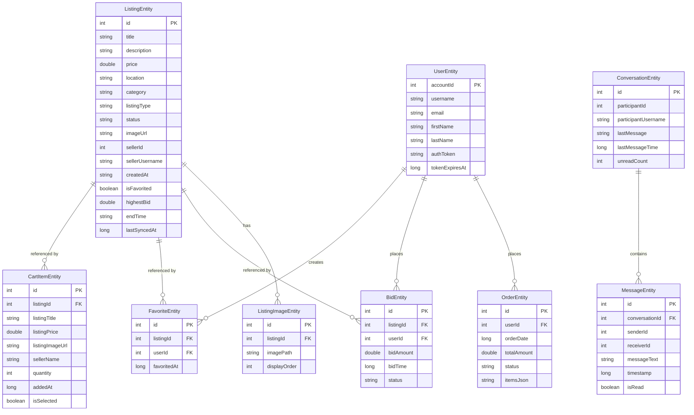

# Design Document: XML Database Integration

## Overview

This design document specifies the architecture for integrating Room database into the MineTehApp Android application. The application is an e-commerce marketplace with features for browsing listings, bidding on auctions, managing shopping carts, messaging, and user profiles. Currently, the app relies solely on REST API calls with no local persistence, resulting in poor offline experience and unnecessary network requests.

The Room database integration will provide:
- Local caching of API responses for offline access
- Improved performance through reduced network calls
- Persistent storage for user data (cart, favorites, session)
- Single source of truth through the Repository pattern
- Automatic data synchronization with the backend

The design follows Android Architecture Components best practices with a clear separation between data layer (Room + API), domain layer (Repositories), and presentation layer (ViewModels + Activities).

## Architecture

### High-Level Architecture

The application will follow the Repository pattern with Room database as the single source of truth:

```
┌─────────────────────────────────────────────────────────────┐
│                     Presentation Layer                       │
│  (Activities, Fragments, ViewModels, Adapters)              │
└────────────────────────┬────────────────────────────────────┘
                         │
                         ▼
┌─────────────────────────────────────────────────────────────┐
│                      Domain Layer                            │
│  (Repositories, Use Cases, Managers)                        │
└────────────┬────────────────────────────┬───────────────────┘
             │                            │
             ▼                            ▼
┌────────────────────────┐   ┌──────────────────────────────┐
│    Data Layer (Local)  │   │   Data Layer (Remote)        │
│    Room Database       │   │   Retrofit API Service       │
│    - DAOs              │   │   - ApiService               │
│    - Entities          │   │   - ApiClient                │
└────────────────────────┘   └──────────────────────────────┘
```

### Data Flow

1. **Read Operations**: Repository checks cache validity → Returns cached data immediately → Fetches fresh data from API in background → Updates cache
2. **Write Operations**: Repository writes to API → On success, updates local cache → On failure, queues for retry
3. **Offline Mode**: Repository returns cached data only → Queues write operations for later sync

### Database Architecture

The Room database will be implemented as a singleton with the following structure:

```kotlin
@Database(
    entities = [
        ListingEntity::class,
        CartItemEntity::class,
        FavoriteEntity::class,
        BidEntity::class,
        MessageEntity::class,
        ConversationEntity::class,
        UserEntity::class,
        ListingImageEntity::class,
        OrderEntity::class
    ],
    version = 1,
    exportSchema = true
)
abstract class MineTehDatabase : RoomDatabase()
```

### Package Structure

```
com.example.mineteh/
├── data/
│   ├── local/
│   │   ├── database/
│   │   │   └── MineTehDatabase.kt
│   │   ├── dao/
│   │   │   ├── ListingDao.kt
│   │   │   ├── CartDao.kt
│   │   │   ├── FavoriteDao.kt
│   │   │   ├── BidDao.kt
│   │   │   ├── MessageDao.kt
│   │   │   ├── ConversationDao.kt
│   │   │   ├── UserDao.kt
│   │   │   ├── ListingImageDao.kt
│   │   │   └── OrderDao.kt
│   │   └── entity/
│   │       ├── ListingEntity.kt
│   │       ├── CartItemEntity.kt
│   │       ├── FavoriteEntity.kt
│   │       ├── BidEntity.kt
│   │       ├── MessageEntity.kt
│   │       ├── ConversationEntity.kt
│   │       ├── UserEntity.kt
│   │       ├── ListingImageEntity.kt
│   │       └── OrderEntity.kt
│   └── remote/
│       └── (existing ApiService, ApiClient)
├── domain/
│   ├── repository/
│   │   ├── ListingRepository.kt
│   │   ├── CartRepository.kt
│   │   ├── FavoriteRepository.kt
│   │   ├── BidRepository.kt
│   │   ├── MessageRepository.kt
│   │   ├── UserRepository.kt
│   │   └── OrderRepository.kt
│   └── manager/
│       ├── SyncManager.kt
│       └── SessionManager.kt
└── (existing view, viewmodel, network, models packages)
```

## Components and Interfaces

### 1. Database Component

**MineTehDatabase**
- Singleton instance using Room.databaseBuilder()
- Provides abstract methods for all DAOs
- Configured with migration strategy
- Implements database callbacks for initialization

```kotlin
companion object {
    @Volatile
    private var INSTANCE: MineTehDatabase? = null
    
    fun getDatabase(context: Context): MineTehDatabase {
        return INSTANCE ?: synchronized(this) {
            val instance = Room.databaseBuilder(
                context.applicationContext,
                MineTehDatabase::class.java,
                "mineteh_database"
            )
            .addMigrations(/* migrations */)
            .fallbackToDestructiveMigration() // Dev only
            .build()
            INSTANCE = instance
            instance
        }
    }
}
```

### 2. Entity Components

All entities will include:
- Primary key with @PrimaryKey annotation
- Foreign key relationships with @ForeignKey
- Indices on frequently queried fields with @Index
- Type converters for complex types (List, Date)

**Key Entities**:

**ListingEntity**: Represents marketplace listings
- Fields: id, title, description, price, location, category, listingType, status, imageUrl, sellerId, sellerUsername, createdAt, isFavorited, highestBid, endTime, lastSyncedAt
- Indices: category, listingType, status, sellerId

**CartItemEntity**: Represents items in shopping cart
- Fields: id (auto-generated), listingId (FK), listingTitle, listingPrice, listingImageUrl, sellerName, quantity, addedAt, isSelected
- Foreign key: listingId references ListingEntity.id with CASCADE delete

**FavoriteEntity**: Junction table for user favorites
- Fields: id (auto-generated), listingId (FK), userId, favoritedAt
- Unique constraint on (userId, listingId)
- Foreign key: listingId references ListingEntity.id with CASCADE delete

**BidEntity**: Represents auction bids
- Fields: id, listingId (FK), userId, bidAmount, bidTime, status
- Foreign key: listingId references ListingEntity.id with CASCADE delete
- Index: listingId, userId

**MessageEntity**: Represents chat messages
- Fields: id, conversationId (FK), senderId, receiverId, messageText, timestamp, isRead
- Foreign key: conversationId references ConversationEntity.id with CASCADE delete
- Index: conversationId

**ConversationEntity**: Represents chat conversations
- Fields: id, participantId, participantUsername, lastMessage, lastMessageTime, unreadCount

**UserEntity**: Represents authenticated user session
- Fields: accountId (PK), username, email, firstName, lastName, authToken, tokenExpiresAt

**ListingImageEntity**: Represents listing images
- Fields: id (auto-generated), listingId (FK), imagePath, displayOrder
- Foreign key: listingId references ListingEntity.id with CASCADE delete

**OrderEntity**: Represents purchase orders
- Fields: id, userId, orderDate, totalAmount, status, itemsJson (JSON string of order items)
- Index: userId

### 3. DAO Components

All DAOs will use suspend functions for coroutine support and return Flow<T> for observable queries.

**ListingDao**:
```kotlin
@Dao
interface ListingDao {
    @Insert(onConflict = OnConflictStrategy.REPLACE)
    suspend fun insertListing(listing: ListingEntity)
    
    @Insert(onConflict = OnConflictStrategy.REPLACE)
    suspend fun insertListings(listings: List<ListingEntity>)
    
    @Query("SELECT * FROM listings WHERE id = :id")
    fun getListingById(id: Int): Flow<ListingEntity?>
    
    @Query("SELECT * FROM listings ORDER BY createdAt DESC")
    fun getAllListings(): Flow<List<ListingEntity>>
    
    @Query("SELECT * FROM listings WHERE category = :category ORDER BY createdAt DESC")
    fun getListingsByCategory(category: String): Flow<List<ListingEntity>>
    
    @Query("SELECT * FROM listings WHERE listingType = :type ORDER BY createdAt DESC")
    fun getListingsByType(type: String): Flow<List<ListingEntity>>
    
    @Query("SELECT * FROM listings WHERE title LIKE '%' || :query || '%' OR description LIKE '%' || :query || '%'")
    fun searchListings(query: String): Flow<List<ListingEntity>>
    
    @Update
    suspend fun updateListing(listing: ListingEntity)
    
    @Delete
    suspend fun deleteListing(listing: ListingEntity)
    
    @Query("DELETE FROM listings")
    suspend fun deleteAllListings()
    
    @Query("SELECT COUNT(*) FROM listings")
    suspend fun getListingCount(): Int
    
    @Query("DELETE FROM listings WHERE id IN (SELECT id FROM listings ORDER BY lastSyncedAt ASC LIMIT :count)")
    suspend fun deleteOldestListings(count: Int)
}
```

**CartDao**:
```kotlin
@Dao
interface CartDao {
    @Insert(onConflict = OnConflictStrategy.REPLACE)
    suspend fun insertCartItem(item: CartItemEntity)
    
    @Query("SELECT * FROM cart_items ORDER BY addedAt DESC")
    fun getAllCartItems(): Flow<List<CartItemEntity>>
    
    @Query("SELECT * FROM cart_items WHERE isSelected = 1")
    fun getSelectedCartItems(): Flow<List<CartItemEntity>>
    
    @Update
    suspend fun updateCartItem(item: CartItemEntity)
    
    @Delete
    suspend fun deleteCartItem(item: CartItemEntity)
    
    @Query("DELETE FROM cart_items")
    suspend fun deleteAllCartItems()
    
    @Query("SELECT SUM(listingPrice * quantity) FROM cart_items WHERE isSelected = 1")
    fun getTotalCartValue(): Flow<Double?>
}
```

**FavoriteDao**:
```kotlin
@Dao
interface FavoriteDao {
    @Insert(onConflict = OnConflictStrategy.REPLACE)
    suspend fun insertFavorite(favorite: FavoriteEntity)
    
    @Delete
    suspend fun deleteFavorite(favorite: FavoriteEntity)
    
    @Query("SELECT * FROM favorites WHERE userId = :userId ORDER BY favoritedAt DESC")
    fun getAllFavorites(userId: Int): Flow<List<FavoriteEntity>>
    
    @Query("SELECT EXISTS(SELECT 1 FROM favorites WHERE listingId = :listingId AND userId = :userId)")
    fun isFavorited(listingId: Int, userId: Int): Flow<Boolean>
    
    @Query("SELECT l.* FROM listings l INNER JOIN favorites f ON l.id = f.listingId WHERE f.userId = :userId ORDER BY f.favoritedAt DESC")
    fun getFavoriteListings(userId: Int): Flow<List<ListingEntity>>
}
```

Similar patterns apply to BidDao, MessageDao, ConversationDao, UserDao, ListingImageDao, and OrderDao.

### 4. Repository Components

Repositories coordinate between API and database, implementing the single source of truth pattern.

**ListingRepository**:
```kotlin
class ListingRepository(
    private val listingDao: ListingDao,
    private val apiService: ApiService,
    private val context: Context
) {
    private val cacheTTL = 5 * 60 * 1000L // 5 minutes
    
    fun getListings(
        category: String? = null,
        type: String? = null,
        search: String? = null,
        forceRefresh: Boolean = false
    ): Flow<Resource<List<ListingEntity>>> = flow {
        // Emit loading state with cached data
        emit(Resource.Loading(getCachedListings(category, type, search)))
        
        // Check if refresh is needed
        if (forceRefresh || isCacheStale()) {
            try {
                val response = apiService.getListings(category, type, search)
                if (response.isSuccessful && response.body()?.success == true) {
                    val listings = response.body()?.data?.map { it.toEntity() } ?: emptyList()
                    listingDao.insertListings(listings)
                    emit(Resource.Success(listings))
                } else {
                    emit(Resource.Error("Failed to fetch listings", getCachedListings(category, type, search)))
                }
            } catch (e: Exception) {
                emit(Resource.Error(e.message ?: "Network error", getCachedListings(category, type, search)))
            }
        } else {
            emit(Resource.Success(getCachedListings(category, type, search)))
        }
    }
    
    private suspend fun getCachedListings(category: String?, type: String?, search: String?): List<ListingEntity> {
        return when {
            search != null -> listingDao.searchListings(search).first()
            category != null -> listingDao.getListingsByCategory(category).first()
            type != null -> listingDao.getListingsByType(type).first()
            else -> listingDao.getAllListings().first()
        }
    }
}
```

**CartRepository**: Manages cart operations with local-only storage (no API sync)
**FavoriteRepository**: Syncs favorites with API and maintains local state
**BidRepository**: Handles bid placement with API validation and local caching
**MessageRepository**: Manages message sending/receiving with background sync
**UserRepository**: Handles authentication and session persistence
**OrderRepository**: Manages order creation and history

### 5. Manager Components

**SyncManager**:
- Uses WorkManager for periodic background sync (every 15 minutes)
- Implements priority-based sync: User data → Listings → Messages → Bids
- Handles conflict resolution (server wins)
- Tracks last sync timestamp per entity type

```kotlin
class SyncManager(
    private val context: Context,
    private val repositories: List<Repository>
) {
    fun schedulePeriodic Sync() {
        val syncRequest = PeriodicWorkRequestBuilder<SyncWorker>(15, TimeUnit.MINUTES)
            .setConstraints(
                Constraints.Builder()
                    .setRequiredNetworkType(NetworkType.CONNECTED)
                    .build()
            )
            .build()
        WorkManager.getInstance(context).enqueueUniquePeriodicWork(
            "periodic_sync",
            ExistingPeriodicWorkPolicy.KEEP,
            syncRequest
        )
    }
}
```

**SessionManager**:
- Manages user authentication state
- Validates token expiration
- Provides current user information
- Handles logout and data cleanup

### 6. Type Converters

Room requires type converters for complex types:

```kotlin
class Converters {
    @TypeConverter
    fun fromTimestamp(value: Long?): Date? = value?.let { Date(it) }
    
    @TypeConverter
    fun dateToTimestamp(date: Date?): Long? = date?.time
    
    @TypeConverter
    fun fromStringList(value: String?): List<String>? {
        return value?.split(",")?.map { it.trim() }
    }
    
    @TypeConverter
    fun toStringList(list: List<String>?): String? {
        return list?.joinToString(",")
    }
}
```

## Data Models

### Entity-to-API Model Mapping

The design uses separate entity classes for Room and API models for clear separation of concerns. Mapping functions convert between them:

```kotlin
// Extension function to convert API model to Entity
fun Listing.toEntity(): ListingEntity {
    return ListingEntity(
        id = id,
        title = title,
        description = description,
        price = price,
        location = location,
        category = category,
        listingType = listingType,
        status = status,
        imageUrl = image,
        sellerId = seller?.accountId,
        sellerUsername = seller?.username ?: "",
        createdAt = createdAt,
        isFavorited = isFavorited,
        highestBid = highestBid?.bidAmount,
        endTime = endTime,
        lastSyncedAt = System.currentTimeMillis()
    )
}

// Extension function to convert Entity to API model
fun ListingEntity.toApiModel(): Listing {
    return Listing(
        id = id,
        title = title,
        description = description,
        price = price,
        location = location,
        category = category,
        listingType = listingType,
        status = status,
        image = imageUrl,
        images = null,
        seller = sellerId?.let { Seller(it, sellerUsername, "", "") },
        createdAt = createdAt,
        isFavorited = isFavorited,
        highestBid = highestBid?.let { Bid(it, "", null) },
        endTime = endTime
    )
}
```

### Database Schema Diagram



### Cache Management Strategy

**Cache Size Limits**:
- Maximum 500 listings in cache
- When limit exceeded, delete oldest entries based on lastSyncedAt
- Cart, favorites, and user data have no size limits (user-specific)

**Cache Invalidation**:
- TTL-based: 5 minutes for listings
- Event-based: Immediate invalidation on user actions (favorite, bid, cart)
- Manual: Pull-to-refresh triggers force refresh

**Offline Queue**:
- Failed write operations stored in a queue table
- Retried when network becomes available
- User notified of pending operations


## Correctness Properties

A property is a characteristic or behavior that should hold true across all valid executions of a system—essentially, a formal statement about what the system should do. Properties serve as the bridge between human-readable specifications and machine-verifiable correctness guarantees.

### Property Reflection

After analyzing all acceptance criteria, several patterns of redundancy emerged:

1. **Entity structure verification (1.1-1.8, 12.1)**: All entity structure requirements can be verified through a single comprehensive test that checks all entities have their required fields. These are examples rather than properties.

2. **DAO CRUD operations (2.1-2.8, 12.2)**: All DAO requirements follow the same pattern - insert then retrieve should return equivalent data. These can be consolidated into a single round-trip property per DAO.

3. **Repository caching (3.1, 3.3)**: These are essentially the same requirement - API data should be cached. Combined into one property.

4. **Favorite status display (5.4, 7.6)**: Duplicate requirements about displaying favorite status from database. Combined into one property.

5. **UI display from database**: Many requirements (4.1, 6.2, 7.4, 8.1, 9.1, 9.3, 11.3, 12.3) test that UI displays database contents. These follow the same pattern and can be consolidated.

6. **Sync behavior (7.5, 9.5, 11.5, 12.5)**: All sync requirements follow the same pattern - data should sync with API when network is available. Combined into one comprehensive property.

7. **Offline mode restrictions (14.2, 14.3)**: Both test offline functionality - combined into one property about offline capabilities.

### Property 1: DAO Round-Trip Persistence

For any entity (Listing, CartItem, Favorite, Bid, Message, Conversation, User, ListingImage, Order), inserting it into the database and then retrieving it by its identifier should return an equivalent entity with all fields preserved.

**Validates: Requirements 2.1, 2.2, 2.3, 2.4, 2.5, 2.6, 2.7, 2.8, 12.2**

### Property 2: API Data Caching

For any successful API response containing entity data, after the repository processes the response, querying the database should return the same data that was received from the API.

**Validates: Requirements 3.1, 3.3, 11.2**

### Property 3: Offline Data Availability

For any cached entity in the database, when network connectivity is unavailable, the repository should return the cached entity without attempting an API call.

**Validates: Requirements 3.2, 14.2**

### Property 4: Cache Expiration Refresh

For any cached listing with lastSyncedAt timestamp older than 5 minutes, when the repository is queried, it should return the cached data immediately and trigger a background API refresh.

**Validates: Requirements 3.5, 3.6**

### Property 5: Search Query Filtering

For any search query string, all listings returned by the database search should contain the query string in either their title or description fields (case-insensitive).

**Validates: Requirements 4.4**

### Property 6: Category Filtering

For any category string, all listings returned by the database category filter should have their category field equal to the specified category.

**Validates: Requirements 4.5**

### Property 7: Database Change Reactivity

For any observable database query (Flow/LiveData), when the underlying data changes in the database, the observer should receive the updated data within one emission cycle.

**Validates: Requirements 4.6**

### Property 8: Listing Retrieval by ID

For any listing ID that exists in the database, querying the database by that ID should return the listing with matching ID and all its associated data.

**Validates: Requirements 5.1**

### Property 9: Image Loading from Cache

For any listing entity with a non-null imageUrl field, the image loading mechanism should attempt to load from disk cache before making a network request.

**Validates: Requirements 5.3**

### Property 10: Favorite Status Consistency

For any listing, the isFavorited field in the listing entity should match the existence of a corresponding Favorite entity with that listing's ID.

**Validates: Requirements 5.4, 7.6**

### Property 11: Cart Item Addition

For any listing, when added to the cart, a CartItem entity should exist in the database with the listing's ID, and the cart item count should increase by one.

**Validates: Requirements 6.1**

### Property 12: Cart Selection State Persistence

For any cart item, toggling its isSelected field should update the database, and subsequent queries should reflect the new selection state.

**Validates: Requirements 6.3**

### Property 13: Cart Item Removal

For any cart item in the database, when removed, querying for that cart item should return null, and the total cart item count should decrease by one.

**Validates: Requirements 6.4**

### Property 14: Cart Total Calculation

For any set of selected cart items, the calculated total should equal the sum of (listingPrice × quantity) for all items where isSelected is true.

**Validates: Requirements 6.5**

### Property 15: Cart Persistence Across Restarts

For any cart state (set of cart items with their quantities and selection states), after simulating an app restart (clearing memory but not database), the cart state should be identical to the state before restart.

**Validates: Requirements 6.7**

### Property 16: Favorite Toggle Idempotence

For any listing, favoriting it twice should result in the same state as favoriting it once (one Favorite entity exists, isFavorited is true). Similarly, unfavoriting twice should equal unfavoriting once (no Favorite entity, isFavorited is false).

**Validates: Requirements 7.1, 7.2, 7.3**

### Property 17: Auction Listing Filtering

For any set of listings in the database, querying for auction listings should return only listings where listingType equals "BID", and all returned listings should have this property.

**Validates: Requirements 8.1**

### Property 18: Bid Insertion and Listing Update

For any valid bid (amount exceeds current highest bid), when inserted into the database, a Bid entity should exist with the correct amount, and the associated listing's highestBid field should be updated to match the new bid amount.

**Validates: Requirements 8.2, 8.4**

### Property 19: Bid Amount Validation

For any bid with an amount less than or equal to the current highest bid for a listing, the bid insertion should be rejected, and no new Bid entity should be created in the database.

**Validates: Requirements 8.3**

### Property 20: Conversation Sorting by Time

For any set of conversations in the database, when queried, they should be returned in descending order by lastMessageTime (most recent first), and each conversation's position should correspond to its relative timestamp.

**Validates: Requirements 9.1**

### Property 21: Unread Message Count Accuracy

For any conversation, the unreadCount field should equal the number of Message entities associated with that conversation where isRead is false.

**Validates: Requirements 9.2**

### Property 22: Message Immediate Persistence

For any message being sent, immediately after the send operation, the message should exist in the database with all its fields, regardless of network status or API response.

**Validates: Requirements 9.4**

### Property 23: Message Reception and Conversation Update

For any incoming message from the API, after processing, the message should exist in the database, and the associated conversation's lastMessage and lastMessageTime fields should be updated to reflect the new message.

**Validates: Requirements 9.6**

### Property 24: Message Read Status Update

For any message with isRead set to false, when marked as read, querying the database should return the message with isRead set to true.

**Validates: Requirements 9.7**

### Property 25: User Session Persistence

For any successful login response containing user data and auth token, after the session manager processes it, the database should contain a User entity with matching accountId, and the authToken and tokenExpiresAt fields should be populated.

**Validates: Requirements 10.1, 10.2**

### Property 26: Token Expiration Enforcement

For any User entity in the database where tokenExpiresAt is less than the current timestamp, the session manager should treat the session as invalid, and getCurrentUser should return null.

**Validates: Requirements 10.4**

### Property 27: Logout Data Cleanup

For any authenticated user, after logout, the database should contain no User entity, no CartItem entities, no Favorite entities, and no draft listings associated with that user.

**Validates: Requirements 10.6**

### Property 28: Listing Creation Validation

For any listing creation request with one or more required fields (title, description, price, location, category, listingType) missing or invalid, the validation should fail, and no listing should be submitted to the API or stored in the database.

**Validates: Requirements 11.1**

### Property 29: Draft Listing Storage on Network Failure

For any listing creation request that fails due to network error, a draft listing entity should be stored in the database with a status indicating it's pending upload.

**Validates: Requirements 11.4**

### Property 30: Order Creation and Cart Clearing

For any non-empty cart, when checkout completes successfully, an Order entity should exist in the database with totalAmount equal to the cart total, and the cart should be empty (zero CartItem entities).

**Validates: Requirements 12.4**

### Property 31: Sync Conflict Resolution

For any entity that exists in both local database and API response with different field values, after sync completes, the database should contain the API version (server wins), and the local changes should be overwritten.

**Validates: Requirements 13.4**

### Property 32: Sync Timestamp Tracking

For any entity type (Listing, Bid, Message, Favorite, Order), after a successful sync operation, the last sync timestamp for that entity type should be updated to the current time.

**Validates: Requirements 13.5**

### Property 33: Offline Mode Network Action Restriction

For any action that requires network connectivity (placing bid, sending message, creating listing, checkout), when the device is offline, the action should be blocked, and no API call should be attempted.

**Validates: Requirements 14.3**

### Property 34: Foreign Key Cascade Deletion

For any listing entity with associated CartItem, Favorite, and Bid entities, when the listing is deleted from the database, all associated entities should also be deleted (cascade), and querying for them should return empty results.

**Validates: Requirements 17.3**

### Property 35: NOT NULL Constraint Enforcement

For any entity with required fields marked as NOT NULL, attempting to insert an entity with null values in those fields should fail, and no entity should be persisted to the database.

**Validates: Requirements 17.1**

### Property 36: Unique Constraint Enforcement

For any entity with unique constraints (User.accountId, Listing.id, Favorite(userId, listingId)), attempting to insert a duplicate should fail with a constraint violation, and the database should contain only the original entity.

**Validates: Requirements 17.5**

### Property 37: Repository Input Validation

For any data being inserted into the database through a repository, if the data has invalid types (e.g., negative price, invalid date format, empty required string), the repository should reject the insertion, and no entity should be persisted.

**Validates: Requirements 17.4**

### Property 38: Cache Size Limit Enforcement

For any database state, when the number of listing entities exceeds 500, the cache management system should automatically delete the oldest listings (by lastSyncedAt), and the final count should not exceed 500.

**Validates: Requirements 16.5**

### Property 39: Pagination Consistency

For any large set of listings (more than 20), when queried with pagination, each page should contain exactly 20 items (except the last page), and the union of all pages should equal the complete set with no duplicates or omissions.

**Validates: Requirements 16.2**

### Property 40: Background Thread Execution

For any database operation (insert, update, delete, query), the operation should execute on a background thread (not the main thread), and the main thread should remain responsive during the operation.

**Validates: Requirements 16.4**

## Error Handling

### Database Errors

**Constraint Violations**:
- Foreign key violations: Log error, notify user that referenced entity doesn't exist
- Unique constraint violations: Log error, treat as no-op (entity already exists)
- NOT NULL violations: Log error, reject operation with validation error message

**Disk Space Errors**:
- When database write fails due to insufficient storage, notify user and suggest clearing cache
- Implement automatic cache cleanup when storage is low
- Provide manual cache clear option in settings

**Corruption Errors**:
- If database corruption is detected, attempt to export user data (cart, favorites)
- Fallback to destructive migration as last resort
- Log corruption events for debugging

### Network Errors

**API Failures**:
- Timeout: Return cached data, retry in background
- 4xx errors: Don't cache, show error to user
- 5xx errors: Return cached data, schedule retry
- No connectivity: Return cached data, queue writes

**Sync Errors**:
- Conflict resolution: Server data always wins
- Partial sync failure: Continue with remaining entities
- Repeated failures: Exponential backoff, max 3 retries

### Data Validation Errors

**Invalid Input**:
- Empty required fields: Show inline validation errors
- Invalid formats: Show format requirements to user
- Out of range values: Show acceptable range

**Business Logic Errors**:
- Bid too low: Show current highest bid and minimum increment
- Expired auction: Disable bidding, show auction ended message
- Expired token: Clear session, redirect to login

### Offline Mode Errors

**Network-Required Actions**:
- Show toast: "This action requires internet connection"
- Offer to queue action for later (where applicable)
- Provide clear indication of offline status

## Testing Strategy

### Dual Testing Approach

This feature requires both unit tests and property-based tests for comprehensive coverage:

**Unit Tests**: Focus on specific examples, edge cases, and integration points
- Entity structure validation (verify all required fields exist)
- DAO method existence and basic functionality
- UI integration tests (specific user flows)
- Error handling scenarios (specific error cases)
- Migration tests (specific version upgrades)
- Configuration tests (indices, constraints, foreign keys)

**Property-Based Tests**: Verify universal properties across all inputs
- All 40 correctness properties defined above
- Each property test should run minimum 100 iterations
- Use appropriate generators for each entity type
- Test with random valid data, edge cases, and boundary conditions

### Property-Based Testing Configuration

**Framework**: Use [Kotest Property Testing](https://kotest.io/docs/proptest/property-based-testing.html) for Kotlin

**Test Structure**:
```kotlin
class ListingDaoPropertyTest : StringSpec({
    lateinit var database: MineTehDatabase
    lateinit var listingDao: ListingDao
    
    beforeTest {
        database = Room.inMemoryDatabaseBuilder(
            context,
            MineTehDatabase::class.java
        ).build()
        listingDao = database.listingDao()
    }
    
    afterTest {
        database.close()
    }
    
    "Property 1: DAO Round-Trip Persistence for Listings" {
        // Feature: xml-database-integration, Property 1: For any entity, inserting and retrieving should return equivalent entity
        checkAll(100, Arb.listing()) { listing ->
            listingDao.insertListing(listing)
            val retrieved = listingDao.getListingById(listing.id).first()
            retrieved shouldBe listing
        }
    }
})
```

**Generators**: Create Arb (Arbitrary) generators for each entity type
- `Arb.listing()`: Generates random valid ListingEntity instances
- `Arb.cartItem()`: Generates random valid CartItemEntity instances
- `Arb.favorite()`: Generates random valid FavoriteEntity instances
- Include edge cases: empty strings, max values, special characters, boundary dates

**Test Organization**:
- One test file per DAO: `ListingDaoPropertyTest.kt`, `CartDaoPropertyTest.kt`, etc.
- One test file per Repository: `ListingRepositoryPropertyTest.kt`, etc.
- One test file for integration properties: `DatabaseIntegrationPropertyTest.kt`

**Tagging**: Each property test must include a comment with the feature name and property number:
```kotlin
// Feature: xml-database-integration, Property 1: DAO Round-Trip Persistence
```

### Unit Testing Focus Areas

**DAO Unit Tests** (using in-memory database):
- Test each DAO method with specific examples
- Test edge cases: empty results, null handling, large datasets
- Test query correctness: search, filter, sort operations
- Test transaction behavior

**Repository Unit Tests** (with mocked API and database):
- Test cache-first strategy with specific scenarios
- Test API failure handling with cached data
- Test offline mode behavior
- Test sync logic with specific conflict scenarios

**UI Integration Tests** (using Espresso):
- Test specific user flows: add to cart → checkout
- Test pull-to-refresh behavior
- Test offline banner display
- Test error message display

**Migration Tests**:
- Test each migration path with specific schema changes
- Verify data preservation across migrations
- Test fallback behavior

### Test Coverage Goals

- Minimum 80% code coverage for DAO classes
- Minimum 80% code coverage for Repository classes
- Minimum 70% code coverage for Manager classes
- 100% coverage of all 40 correctness properties through property-based tests

### Testing Tools

- **JUnit 4**: Test framework
- **Kotest**: Property-based testing framework
- **Room Testing**: In-memory database for DAO tests
- **MockK**: Mocking framework for repositories
- **Espresso**: UI testing framework
- **Truth**: Assertion library

